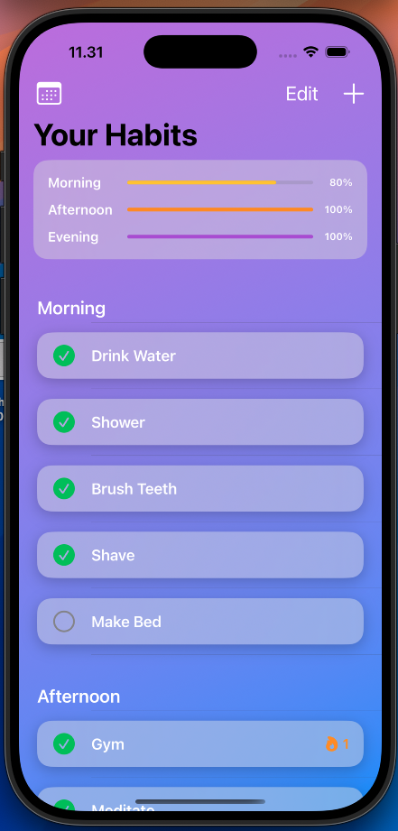
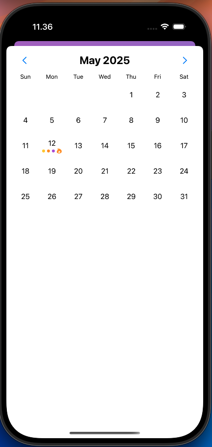

# Smart Habit Tracker

A SwiftUI app inspired by James Clear’s *Atomic Habits*, built around the concept of **habit stacking**. Organize your daily routines into Morning, Afternoon, and Evening blocks, track your progress, and maintain streaks over time.

---

## 📱 Features

- **Routine Stacking**  
  Group habits into Morning, Afternoon, and Evening routines to build sustainable daily workflows.

- **Persistent Storage**  
  Core Data–backed storage for habits and completion records.

- **Progress Summary**  
  At-a-glance progress bars show your percentage of habits completed in each time-of-day slot.

- **Calendar & Streaks**  
  Calendar view highlights days where you completed 100 % of a routine slot, with streak icons for perfect days.

- **CRUD Operations**  
  • Add, edit (swipe), reorder (drag), and delete habits  
  • Inline habit completion toggles  

- **Automatic Daily Rollover**  
  Habits automatically “uncheck” themselves each new day.

---

## 🛠 Tech Stack

- **Language:** Swift 5  
- **UI:** SwiftUI  
- **Persistence:** Core Data  
- **iOS Compatibility:** iOS 16+

---

## 🚀 Getting Started

### Prerequisites

- Xcode 15 or later  
- iOS 16 SDK

### Installation

1. Clone the repository:  
   ```bash
   git clone https://github.com/yourusername/SmartHabitTracker.git
   cd SmartHabitTracker

2. Open the project in Xcode:
  open SmartHabitTracker.xcodeproj

3. Build & run on the simulator or your device.

## 📸 Screenshots

### Home View  


### Calendar View with Streaks  


## 🧠 Inspiration

This app is heavily inspired by *Atomic Habits* by James Clear. It leverages the power of **habit stacking**—linking new habits onto existing routines—to help users build lasting behavior change.

## ✨ Future Improvements

- AI-powered habit suggestions based on your completion history  
- Custom reminder scheduling with local notifications  
- Widget support for glanceable progress  
- Siri Shortcuts integration  
- CloudKit sync across devices  


